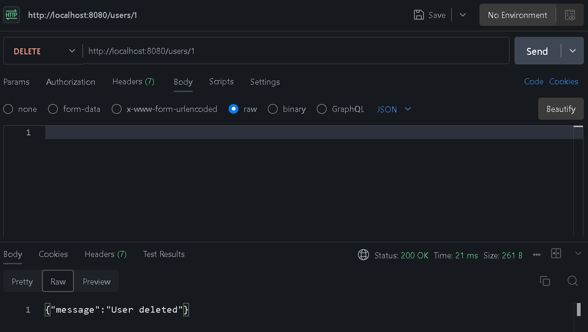
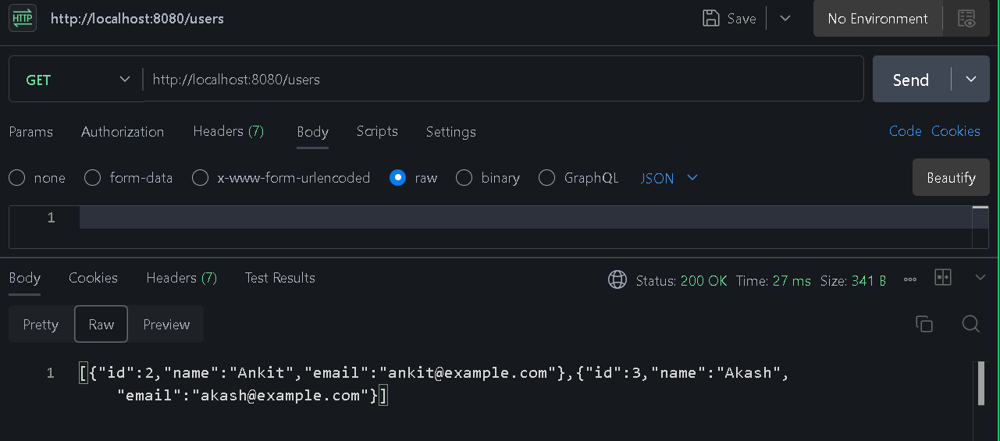

# 📁 Local JSON Server CRUD Operations

This project demonstrates full **CRUD (Create, Read, Update, Delete)** functionality using a local `db.json` file with a custom Node.js server (or JSON Server). All operations are tested using **Postman**, and screenshots are included below for reference.

---

## 🔧 Technologies Used

- Node.js
- Express.js
- JSON as local database (`db.json`)
- Postman (for API testing)

---

## 📷 Screenshots of Each Operation

### 📘 READ – Get All Users

Fetches a list of all user entries from the local database.


---

### 🔍 READ – Get Single User by ID

Retrieves a specific user using their unique `id`.


---

### ✍️ CREATE – Add a New User

Adds a new user to `db.json` using a POST request.


---

### ✏️ UPDATE – Replace User with PUT (by ID)

Updates all fields of a user object with the given `id`.


---

### 🛠 PARTIAL UPDATE – Modify User with PATCH (by ID)

Updates one or more fields of an existing user object.


---

### ❌ DELETE – Remove User by ID

Deletes a user from the database by `id`.



---

### 🧾 Final State – All Users After Performing CRUD Operations

View of the database after completing all operations.



---

## 🚀 How to Run the Project

Clone this repo and do 👇

### 2. Install Dependencies

```bash
npm install
```

### 3. Start the Server

```bash
node server.js or
nodemon server.js
```

> Server will run at `http://localhost:3000`

---

## ✅ Endpoints Overview

| Method | Endpoint     | Description              |
| ------ | ------------ | ------------------------ |
| GET    | `/users`     | Get all users            |
| GET    | `/users/:id` | Get user by ID           |
| POST   | `/users`     | Create a new user        |
| PUT    | `/users/:id` | Replace user by ID       |
| PATCH  | `/users/:id` | Update user fields by ID |
| DELETE | `/users/:id` | Delete user by ID        |

---

## 📂 Database File – `db.json`

This file acts as a local JSON database storing all user data. All operations are performed directly on this file.

---
